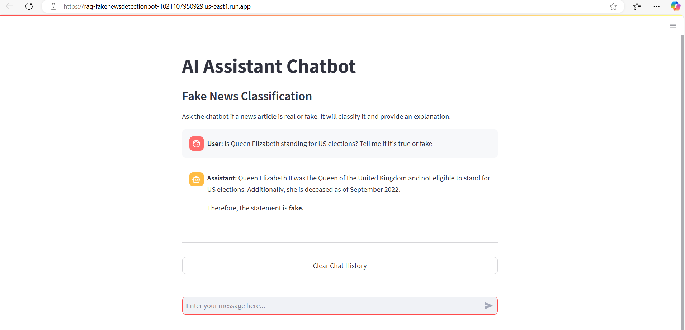

# 📰 Fake News Detection Chatbot

This project implements a **Fake News Detection Chatbot** using a hybrid approach combining traditional ML/DL models with **Retrieval-Augmented Generation (RAG)** powered by **Google Cloud Platform (GCP)** services, **LangChain**, and **Streamlit**.

## 🚀 Project Overview


 

### 🔹 1. Data Preprocessing & Model Development
- **Dataset Preparation:**
  - Combined true and fake news datasets with proper labeling
  - Extensive text preprocessing including tokenization, stemming, and lemmatization
  - Removed stopwords and special characters for better feature extraction

- **Feature Engineering:**
  - Implemented TF-IDF and Count Vectorization
  - Word embeddings using Word2Vec for semantic understanding
  - Maximum features: 5500 words with n-gram range (1,3)

- **Model Training:**
  - **Traditional ML Models:**
    - Naive Bayes
    - Logistic Regression
    - Decision Trees
    - Cross-validation with stratified K-Fold
  
  - **Deep Learning (LSTM):**
    - Bidirectional LSTM architecture
    - Embedding dimension: 100
    - Multiple LSTM layers with dropout
    - Achieved [your accuracy]% accuracy on test set
    

### 🔹 2. Retrieval-Augmented Generation (RAG)
- **Vector Store:** 
  - Used **ChromaDB** for storing news embeddings
  - Implemented similarity search for relevant document retrieval
- **Hosting:** Deployed on **Google Cloud Platform (GCP)**
- **Retrieval:** Fetches relevant documents for context-aware classification

### 🔹 3. LangChain Integration
- **Chunking:** Preprocesses news articles into manageable segments
- **Embeddings:** Uses TextEmbedding-Gecko for vector representations
- **Conversational Memory:** Maintains context across user interactions

### 🔹 4. LLM: Gemini Pro
- **Model:** Leverages **Gemini Pro** for:
  - Natural language understanding
  - Classification reasoning
  - Explanation generation
- **Integration:** Combined with trained ML models for robust predictions

### 🔹 5. Deployment: GCP Cloud Run
- **Cloud Run:** Containerized deployment for scalability
- **CI/CD:** Automated deployment using **Google Cloud Build**
- **Environment:** Configured for both CPU and GPU inference

### 🔹 6. UI: Streamlit Chatbot
- **Frontend:** Interactive chat interface
- **Features:**
  - Real-time news verification
  - Detailed explanation of classifications
  - Confidence scores display

---

## 🛠️ Setup Instructions

### 🔧 1. Install Dependencies
```bash
pip install -r requirements.txt
```

### 🔹 2. Set Up Environment Variables
Create a `.env` file and add:
```ini
GCP_PROJECT_ID=your-gcp-project-id
GEMINI_API_KEY=your-api-key
CHROMA_DB_PATH=your-chroma-db-path
```

### 🔹 3. Run Locally
```bash
streamlit run app.py
```

### 🔹 4. Deploy on Cloud Run
```bash
gcloud run deploy fakenews-chatbot \
  --source . \
  --platform managed \
  --region us-east1 \
  --allow-unauthenticated \
  --set-env-vars GOOGLE_ENTRYPOINT="python app.py" \
  --max-instances 2 \
  --min-instances 1
```


## 📊 Model Performance

| Model | Accuracy | Precision | Recall | F1 Score |
|-------|----------|-----------|---------|-----------|
| Naive Bayes | [score] | [score] | [score] | [score] |
| Logistic Regression | [score] | [score] | [score] | [score] |
| LSTM | [score] | [score] | [score] | [score] |

## 🔄 Pipeline Architecture

1. **Input Processing:**
   - Text cleaning and normalization
   - Feature extraction using TF-IDF/Word embeddings

2. **Classification Flow:**
   - ML model prediction
   - RAG context retrieval
   - Gemini Pro reasoning
   - Confidence score calculation

3. **Response Generation:**
   - Classification result
   - Explanation synthesis
   - Supporting evidence presentation

## 📝 Future Improvements

- [ ] Implement ensemble learning with multiple models
- [ ] Add support for multiple languages
- [ ] Enhance real-time news source verification
- [ ] Improve explanation generation with more context

